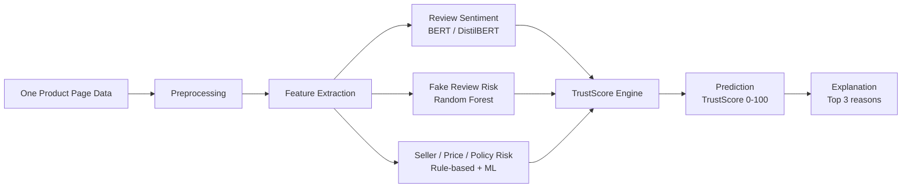

# AI/ML Model Specification

## Model objective
Given one product page, predict a final TrustScore from 0 to 100 and generate an explanation.

## Input data

```json
{
  "url": "string",
  "site": "string",
  "product_title": "string",
  "description": "string",
  "price": 49.99,
  "currency": "USD",
  "average_market_price": 59.99,
  "rating": 4.3,
  "review_count": 120,
  "seller": {
    "name": "Example Store",
    "rating": 4.6,
    "review_count": 5000,
    "years_active": 3
  },
  "return_policy": "30-day returns available",
  "reviews": [
    {
      "text": "Good quality and fast delivery.",
      "rating": 5,
      "date": "2026-01-01",
      "verified_purchase": true
    }
  ]
}
```

## AI/ML-only prediction workflow



## Step 1: Preprocessing

### Purpose
Clean product page data before feature extraction and model inference.

### Operations
- Convert review text to lowercase.
- Remove extra whitespace and HTML tags.
- Remove empty reviews.
- Deduplicate exact repeated reviews.
- Normalize rating to 0 to 1 or 0 to 100 scale.
- Extract policy keywords such as return, refund, warranty, exchange, days.
- Extract risk keywords such as fake, broken, scam, refund, never arrived, poor quality.

### Output
Cleaned reviews, normalized ratings, seller fields, price fields, and policy text.

## Step 2: Model Group 1 - Review Sentiment Model

### Algorithm
BERT or DistilBERT using Hugging Face Transformers.

### Purpose
Understand customer review meaning and classify reviews as positive, neutral, or negative.

### Process
1. Tokenize each review.
2. Run BERT or DistilBERT sentiment model.
3. Aggregate review-level sentiment predictions into one product-level sentiment score.

### Output
`sentiment_score` from 0 to 100.

### Example
```text
Review: "Delivery was fast but the product broke after one day."
Model output: Negative sentiment
Product sentiment contribution: lower score
```

## Step 3: Model Group 2 - Fake Review Detection Model

### Algorithm
Random Forest Classifier using scikit-learn.

### Purpose
Detect suspicious review patterns and estimate fake review probability.

### Feature examples
- `duplicate_review_rate`: percentage of repeated or near-duplicate reviews.
- `short_five_star_rate`: percentage of very short 5-star reviews.
- `avg_review_length`: average token length.
- `rating_sentiment_mismatch_rate`: high star rating but negative text, or low rating but very positive text.
- `review_similarity_mean`: average similarity between reviews.
- `extreme_rating_ratio`: ratio of 1-star and 5-star reviews.
- `verified_purchase_ratio`: if available.
- `negative_keyword_rate`: complaint keyword rate.

### Output
- `fake_review_probability`: 0 to 1.
- `review_authenticity_score`: `100 * (1 - fake_review_probability)`.

## Step 4: Model Group 3 - Seller, Price, and Policy Risk Model

### Algorithm
Rule-based risk scoring plus optional ML.

### Purpose
Score seller reliability, price safety, and return policy clarity.

### Seller score features
- Seller rating.
- Seller review count.
- Years active, if available.
- Negative seller feedback rate, if available.

### Price score features
- Current product price.
- Average market price, if available.
- Price ratio: `price / average_market_price`.
- Suspicious low price flag.

### Policy score features
- Return policy exists.
- Refund period exists.
- Warranty words exist.
- Clear time period exists, such as 14 days or 30 days.

### Output
- `seller_reliability_score`: 0 to 100.
- `price_safety_score`: 0 to 100.
- `return_policy_clarity_score`: 0 to 100.

## Step 5: TrustScore calculation

```text
TrustScore =
      30% Review Authenticity
    + 20% Seller Reliability
    + 20% Sentiment Score
    + 15% Return Policy Clarity
    + 10% Price Safety
    + 5% User Feedback History
```

### Component score defaults
If a score is missing, use neutral value 50 and reduce confidence.

## Step 6: Risk classification and explanation generation

```text
Input:
    Final TrustScore
    Review Authenticity Score
    Seller Reliability Score
    Sentiment Score
    Return Policy Clarity Score
    Price Safety Score

Process:
    If TrustScore >= 80:
        Risk Level = Low Risk
    Else if TrustScore >= 50:
        Risk Level = Medium Risk
    Else:
        Risk Level = High Risk

    Explanation = []

    If Review Authenticity Score is low:
        Add "Some reviews look repeated or suspicious" to Explanation

    If Seller Reliability Score is low:
        Add "Seller reliability is weak" to Explanation

    If Sentiment Score is low:
        Add "Many reviews contain negative complaints" to Explanation

    If Return Policy Clarity Score is low:
        Add "Return policy is unclear" to Explanation

    If Price Safety Score is low:
        Add "Product price is unusually low compared to market price" to Explanation

    Select top 3 most important reasons from Explanation

Output:
    Risk Level
    Top 3 Explanation Reasons
```

## Confidence score
Confidence should be lower when:
- Few reviews are available.
- Seller fields are missing.
- Price comparison data is missing.
- Return policy is not visible.
- Model prediction probabilities are uncertain.

Suggested formula:

```text
confidence = average(
    review_data_completeness,
    seller_data_completeness,
    price_data_completeness,
    policy_data_completeness,
    model_probability_confidence
)
```

## Example final output

```json
{
  "trust_score": 68,
  "risk_level": "Medium Risk",
  "confidence": 0.76,
  "component_scores": {
    "review_authenticity": 58,
    "seller_reliability": 80,
    "sentiment": 65,
    "return_policy_clarity": 45,
    "price_safety": 78,
    "user_feedback_history": 70
  },
  "top_reasons": [
    "Some reviews look repeated or suspicious.",
    "Return policy is unclear.",
    "Several reviews mention product quality problems."
  ],
  "recommendation": "Check return policy and seller details before buying."
}
```
