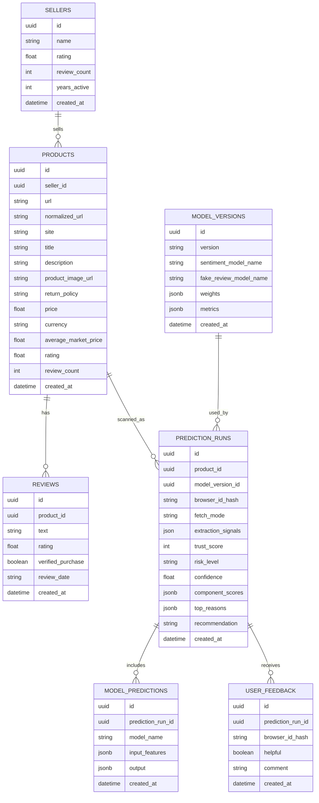

# Database Schema - Supabase PostgreSQL

## Purpose
Store product scan data, seller data, review samples, model predictions, TrustScore logs, and user feedback.

## Entity relationship diagram



## SQL schema

```sql
create extension if not exists "pgcrypto";

create table if not exists sellers (
    id uuid primary key default gen_random_uuid(),
    name text,
    rating double precision,
    review_count integer,
    years_active integer,
    created_at timestamptz not null default now()
);

create table if not exists products (
    id uuid primary key default gen_random_uuid(),
    seller_id uuid references sellers(id) on delete set null,
    url text not null,
    normalized_url text not null,
    site text,
    title text,
    description text,
    product_image_url text,
    return_policy text,
    price double precision,
    currency text,
    average_market_price double precision,
    rating double precision,
    review_count integer,
    created_at timestamptz not null default now()
);

create index if not exists idx_products_url on products(url);
create unique index if not exists idx_products_normalized_url on products(normalized_url);
create index if not exists idx_products_site on products(site);

create table if not exists reviews (
    id uuid primary key default gen_random_uuid(),
    product_id uuid not null references products(id) on delete cascade,
    text text not null,
    rating double precision,
    verified_purchase boolean,
    review_date text,
    created_at timestamptz not null default now()
);

create index if not exists idx_reviews_product_id on reviews(product_id);

create table if not exists model_versions (
    id uuid primary key default gen_random_uuid(),
    version text not null unique,
    sentiment_model_name text,
    fake_review_model_name text,
    weights jsonb,
    metrics jsonb,
    created_at timestamptz not null default now()
);

create table if not exists prediction_runs (
    id uuid primary key default gen_random_uuid(),
    product_id uuid not null references products(id) on delete cascade,
    model_version_id uuid references model_versions(id) on delete set null,
    browser_id_hash text,
    fetch_mode text,
    extraction_signals jsonb not null default '[]'::jsonb,
    trust_score integer not null,
    risk_level text not null,
    confidence double precision,
    component_scores jsonb not null,
    top_reasons jsonb not null,
    recommendation text,
    created_at timestamptz not null default now()
);

create index if not exists idx_prediction_runs_product_id on prediction_runs(product_id);
create index if not exists idx_prediction_runs_created_at on prediction_runs(created_at);
create index if not exists idx_prediction_runs_product_created_at
    on prediction_runs(product_id, created_at desc);
create index if not exists idx_prediction_runs_browser_created_at
    on prediction_runs(browser_id_hash, created_at desc)
    where browser_id_hash is not null;

create table if not exists model_predictions (
    id uuid primary key default gen_random_uuid(),
    prediction_run_id uuid not null references prediction_runs(id) on delete cascade,
    model_name text not null,
    input_features jsonb,
    output jsonb,
    created_at timestamptz not null default now()
);

create index if not exists idx_model_predictions_run_id on model_predictions(prediction_run_id);

create table if not exists user_feedback (
    id uuid primary key default gen_random_uuid(),
    prediction_run_id uuid not null references prediction_runs(id) on delete cascade,
    browser_id_hash text,
    helpful boolean not null,
    comment text,
    created_at timestamptz not null default now()
);

create index if not exists idx_user_feedback_prediction_run_id on user_feedback(prediction_run_id);
create index if not exists idx_user_feedback_prediction_browser
    on user_feedback(prediction_run_id, browser_id_hash)
    where browser_id_hash is not null;
```

## Seed model version

```sql
insert into model_versions (
    version,
    sentiment_model_name,
    fake_review_model_name,
    weights,
    metrics
)
values (
    '0.3.0',
    'distilbert-base-uncased-finetuned-sst-2-english',
    'calibrated_tfidf_fake_review_v3',
    '{
      "review_authenticity": 0.30,
      "seller_reliability": 0.20,
      "sentiment": 0.20,
      "return_policy_clarity": 0.15,
      "price_safety": 0.10,
      "user_feedback_history": 0.00
    }'::jsonb,
    '{"model_set": "v3_production", "feedback_scoring": "not_applied"}'::jsonb
)
on conflict (version) do nothing;
```

## Data retention recommendation
For a class prototype, store only what is needed for demonstration. Avoid storing private user data. Hash anonymous browser IDs before feedback persistence.
