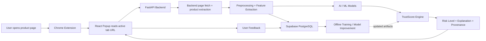

# System Architecture

## Purpose
This document describes how the extension, frontend UI, backend API, AI/ML models, and database work together.

## Architecture overview



## Component responsibilities

### 1. Chrome Extension
Responsible for:
- Reading the active tab URL.
- Sending only the URL to the backend.
- Displaying TrustScore, risk level, reasons, and recommendation.
- Collecting optional user feedback.

Extension parts:
- `background.ts`: minimal service worker used for extension lifecycle hooks.
- `popup/App.tsx`: React UI shown to user.

### 2. Frontend popup
Responsible for:
- Showing current scan status.
- Showing TrustScore and risk label.
- Showing component scores.
- Showing top 3 explanation reasons.
- Sending helpful/not helpful feedback.

### 3. FastAPI backend
Responsible for:
- Receiving scan requests from the extension.
- Fetching and parsing public product pages.
- Extracting product title, image, price, seller, reviews, and policy text.
- Validating request payloads using Pydantic.
- Running preprocessing and feature extraction.
- Running model inference.
- Calculating final TrustScore.
- Saving logs and feedback to Supabase PostgreSQL.
- Returning a structured response.
- Returning non-sensitive provenance: fetch mode, extraction signals, model modes, and artifact status.

### 4. AI/ML layer
Three model groups are used:

1. Review Sentiment Model
   - Algorithm: BERT or DistilBERT.
   - Output: sentiment score from 0 to 100.

2. Fake Review Detection Model
   - Algorithm: Random Forest.
   - Output: fake review probability and review authenticity score.

3. Seller, Price, and Policy Risk Model
   - Algorithm: rule-based scoring plus optional ML.
   - Output: seller reliability score, price safety score, and return policy clarity score.

### 5. TrustScore Engine
Combines model outputs into a final score.

```text
TrustScore =
    0.30 * Review Authenticity
  + 0.20 * Seller Reliability
  + 0.20 * Sentiment Score
  + 0.15 * Return Policy Clarity
  + 0.10 * Price Safety
  + 0.05 * User Feedback History
```

### 6. Database
Stores:
- Products scanned.
- Sellers.
- Reviews.
- Prediction runs.
- Component scores.
- User feedback.
- Model versions.
- Hashed browser IDs when feedback is submitted.

## Data flow

1. User opens a product page.
2. Extension reads the active tab URL.
3. Extension sends `{ "url": "..." }` to `/api/v1/scan`.
4. Backend validates the URL and fetches the public product page.
5. Backend extracts product data from HTML and structured metadata.
6. Backend preprocesses reviews and metadata.
7. AI/ML models generate component scores.
8. TrustScore Engine combines the scores.
9. Backend stores the prediction log when `DATABASE_URL` is configured.
10. Backend returns product metadata, TrustScore, reasons, and model/extraction provenance.
11. Popup displays result.
12. User optionally gives feedback.
13. Feedback is stored when persistence is enabled, or accepted in local demo mode.

## Security and privacy constraints

- Do not collect passwords, payment card data, cookies, or private account data.
- Collect only product-page data required for risk analysis.
- Store anonymous browser ID only if needed for feedback deduplication.
- Hash browser IDs before persistence.
- Use HTTPS in deployed mode.
- Limit extension permissions to the minimum required host permissions.

## Extension permissions recommendation
For MVP, use narrow host permissions during development. For example:

```json
{
  "permissions": ["activeTab", "scripting", "storage"],
  "host_permissions": ["http://localhost:8000/*", "http://127.0.0.1:8000/*"]
}
```

The extension does not need persistent content-script host permissions. It uses `activeTab` and `scripting` only after the popup is opened to preview the visible product title, image, seller, and price/rating signals. It also does not request broad HTTP/HTTPS host permissions for product images; unsafe image URLs are filtered and failed image loads fall back to the placeholder icon.
