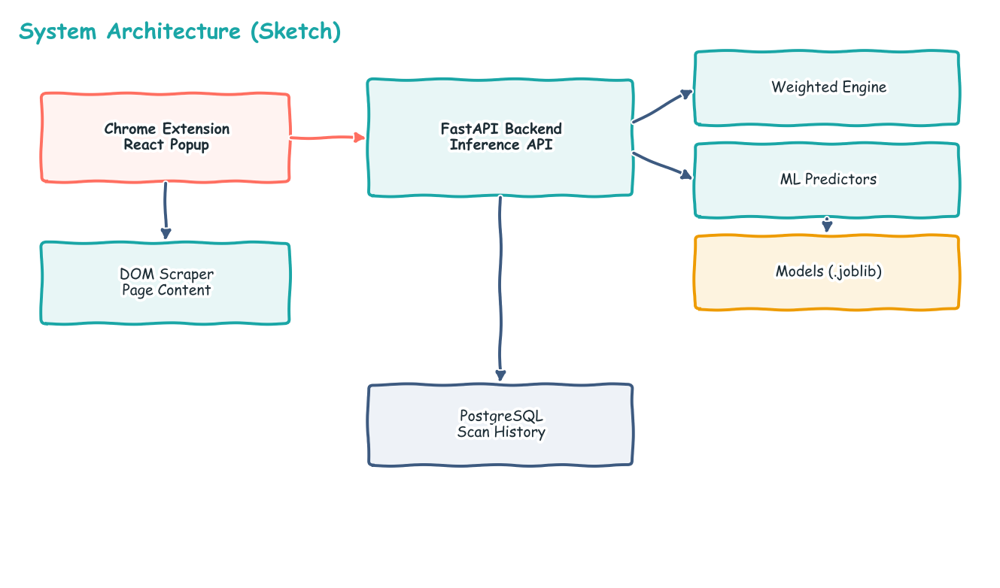
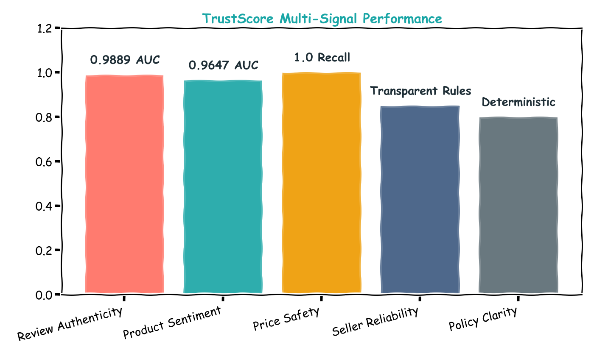
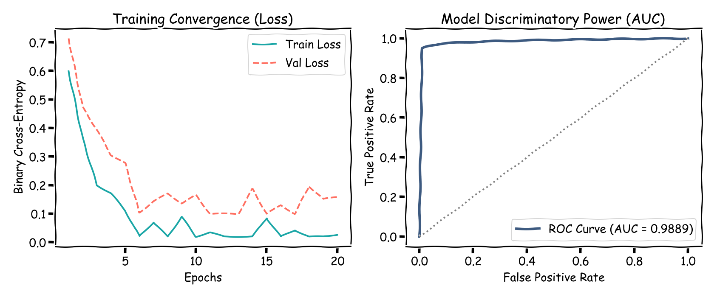
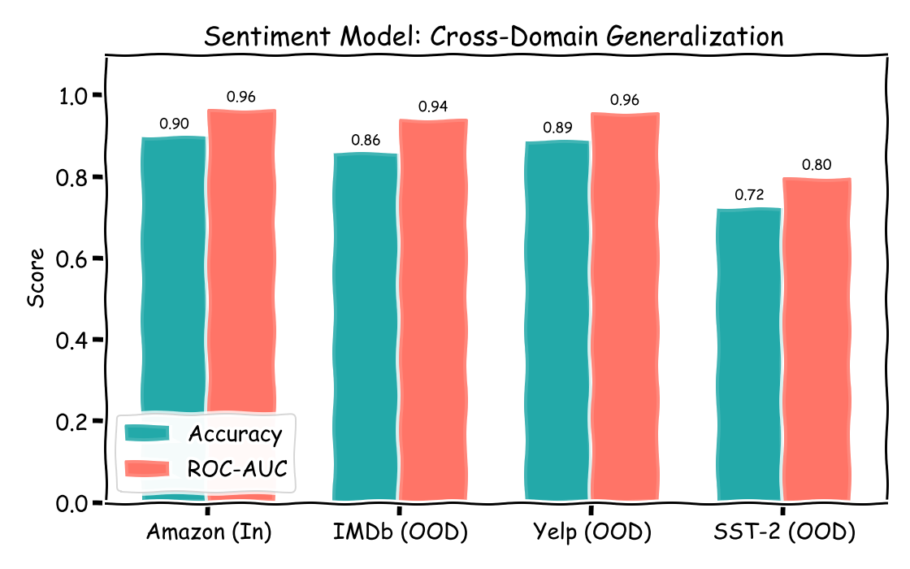
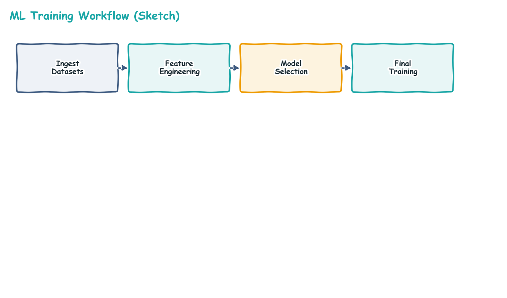

<!-- _class: lead -->

# AI TrustScore

### Explainable trust scoring for online shopping

Yesui Erkhembayar · s24229521 · 18 June 2026

---

## 1. System Design & Implementation

- **Architecture:** React 19 / TypeScript extension + FastAPI (Python 3.13) backend.
- **Explainable AI:** Five distinct signals combined via weighted scoring:
  - **Review Authenticity:** LinearSVC identifies machine-generated text.
  - **Product Sentiment:** Calibrated polarity from customer feedback.
  - **Price Safety:** Unsupervised anomaly detection (IsolationForest).
  - **Seller Reliability:** Heuristic analysis of rating & active years.
  - **Policy Clarity:** Rule-based verification of return terms.

---

## 2. Multi-Signal Performance Summary

- **Holistic Validation:** Each signal is measured by the most relevant metric.
- **High Discriminatory Power:** Both text-based models exceed 0.96 ROC-AUC.
- **Robustness:** Non-ML signals use deterministic rules to avoid bias.

---

## 3. Deep Dive: Review Authenticity

- **Winner:** `calibrated_linear_svc` on `tfidf` features.
- **Metric:** Achieved a final **ROC-AUC of 0.9889**.
- **Efficiency:** 705KB model size with <1.5µs/row latency.

---

## 4. Dataset Overview & Iterative Results

| Dataset | Rows | Use Case |
|---|---|---|
| **Fake-Reviews** (ArijitDas) | 40,526 | Text authenticity training |
| **Amazon Reviews 2023** | 450,000 | Sentiment analysis training |
| **Amazon Metadata** | 180,000 | Price & Seller risk baselines |
| **OOD Benchmark** (Yelp/IMDB/SST2) | 192,349 | Cross-domain generalization tests |

| Model Component | Initial Baseline | Experimental | Final Optimized System |
|---|---|---|---|
| Fake review — ROC-AUC | 0.961 | 0.989 | **0.9889** (LinearSVC) |
| Sentiment — ROC-AUC | 0.864 | 0.965 | **0.9647** (Calibrated) |
| Seller / Price risk | 0.58 / 0.60 | **Leakage Found** | **Robust Ruleset** |

---

## 5. Scientific Rigor: Finding & Fixing Leakage

- **The Discovery:** We identified **Data Leakage** in the initial risk model (accuracy near 1.0).
- **The Fix:** Moved to **unsupervised anomaly detection** for price and **transparent heuristics**
  for sellers, ensuring the results are honest and defensible.
- **Generalization:** Tested on Yelp/IMDb to confirm performance outside Amazon.

---

## 6. Conclusions & Future Work

- **Final Product:** A fully functional, reproducible end-to-end system.
- **Key Insight:** Scientific honesty led to a more robust, trustworthy model.
- **Next Steps:**
  - Collect human-labeled ground truth for better risk modeling.
  - Deploy DistilBERT for more nuanced sentiment analysis.

**Summary:** Explainable shopping trust · 5-signal pipeline · **0.989 AUC**.

